# 深入理解mysql innodb 事务
## 事务
事务(Transaction)是访问并可能更新数据库中各种数据项的一个程序执行单元[^1]。事务是恢复和并发控制的基本单位。
事务应该具有4个属性：原子性、一致性、隔离性、持久性。
## 特性
###原子性（atomicity）
表示组成一个事务的多个数据库操作是一个不可分割的原子单元，只有所有的操作执行成功，整个事务才提交。事务中的任何一个数据库操作失败，已经执行的任何操作都必须被撤销，让数据库返回初始状态。

[//]: <> (原子性：提供了互斥访问，同一时刻只能有一个线程对它进行操作)

### 一致性（consistency）
事务必须是使数据库从一个一致性状态变到另一个一致性状态。事务操作成功后，数据库所处的状态和他的业务规则是一致的，即数据不会被破坏。完整性约束.
[//]: # (哈希一致性、缓存一致性, 分布式一致性)
### 持久性（durability）
指一个事务一旦提交，它对数据库中数据的改变就应该是永久性的。接下来的其他操作或故障不应该对其有任何影响。

---

### 隔离性（isolation）
一个事务的执行不能被其他事务干扰。即一个事务内部的操作及使用的数据对并发的其他事务是隔离的，并发执行的各个事务之间不能互相干扰。

#### 事务隔离级别（Transaction Isolation Level）
1. READ_UNCOMMITTED
2. READ_COMMITTED
3. REPEATABLE_READ
4. SERIALIZABLE

#### 数据读问题
1. Dirty Read（脏读）
2. Unrepeatable Read（不可重复读）
3. Phantom Read（幻读）
一个事务在前后两次查询同一范围的时候，后一次查询看到了前一次查询没有看到的行

---

## 问题1 Innodb 怎么实现的事务ACID?

## 问题2 REPEATABLE_READ 能否防止幻读问题? 

---

## 事务ACID实现

- 隔离性: 基于锁和MVCC
- 原子性:
MySQL事务的原子性是通过undo log来实现的。undo log是InnoDB存储引擎特有的。具体的实现方式是：将所有对数据的修改（增、删、改）都写入日志（undo log）。如果一个事务中的一部分操作已经成功，但另一部分操作，由于断电/系统崩溃/其它的软硬件错误而无法成功执行，则通过回溯日志，将已经执行成功的操作撤销，从而达到全部操作失败的目的。
- 持久性: 
MySQL事务的持久性是通过redo log来实现的。redo log也是InnoDB存储引擎特有的。具体实现方式是：当发生数据修改（增、删、改）的时候，InnoDB引擎会先将记录写到redo log中，并更新内存，此时更新就算完成了。同时InnoDB引擎会在合适的时机将记录刷到磁盘中。
- 一致性: 原子性、持久性和隔离性，都是为了保证数据库状态的一致性。

---

### repeatable read 隔离级别下查询+插入 不会幻读 

```
drop table if exists author
CREATE TABLE `author` (
  `id` int(11) NOT NULL AUTO_INCREMENT,
  `name` varchar(255) DEFAULT NULL,
  `age` int(11) DEFAULT NULL,
  PRIMARY KEY (`id`),
  KEY `idx_name` (`name`)
) ENGINE=InnoDB AUTO_INCREMENT=26 DEFAULT CHARSET=utf8
INSERT into author VALUES (1,'g1',20),(5,'g5',20),(15,'g15',30),(20,'g20',30);

```


|时间|session 1|session2|
|-|-|
|T1|begin;||
|T2||begin;|
|T3|select * from author where name='g5' <br>结果:(5,g5,20)||
|T4||select * from author where name='g5' <br>结果:(5,g5,20)|
|T5|update author set age=21 where name='g5'; <br>更新成功||
|T6|commit;||
|T7||select * from author where name='g5' <br>结果:(5,g5,20)

---

```
drop table if exists author
CREATE TABLE `author` (
  `id` int(11) NOT NULL AUTO_INCREMENT,
  `name` varchar(255) DEFAULT NULL,
  `age` int(11) DEFAULT NULL,
  PRIMARY KEY (`id`),
  KEY `idx_name` (`name`)
) ENGINE=InnoDB AUTO_INCREMENT=26 DEFAULT CHARSET=utf8
INSERT into author VALUES (1,'g1',20),(5,'g5',20),(15,'g15',30),(20,'g20',30);
```

|时间|session 1|session2|
|-|-|
|T1|begin;||
|T2||begin;|
|T3|select * from author where name='g15' for update; <br>结果:(15,g15,30)||
|T4||select * from author where name='g15' for update; <br>阻塞,等待session1锁释放|
|T5|update author set age=31 where name='g15'; <br>更新成功||
|T6|commit;||
|T7||select for update <br>获得锁,执行结果:(15,g15,31)|
|T8||update author set age=32 where name='g15'; <br>更新成功|
|T9||commit;|


---

```
drop table if exists author
CREATE TABLE `author` (
  `id` int(11) NOT NULL AUTO_INCREMENT,
  `name` varchar(255) DEFAULT NULL,
  `age` int(11) DEFAULT NULL,
  PRIMARY KEY (`id`),
  KEY `idx_name` (`name`)
) ENGINE=InnoDB AUTO_INCREMENT=26 DEFAULT CHARSET=utf8
INSERT into author VALUES (1,'g1',20),(5,'g5',20),(15,'g15',30),(20,'g20',30);
```

|时间|session 1|session2|
|-|-|
|T1|begin;||
|T2||begin;|
|T3|select * from author where name='g16' for update; <br>结果:Empty set||
|T4||select * from author where name='g18' for update; <br>结果:Empty set|
|T5|insert into author (id,name,age) values(16,'g16',16); <br>阻塞,等待session2锁释放||
|T6||insert into author (id,name,age) values(18,'g18',18); <br>死锁回滚|
|T7|插入成功||
|T8|commit; |||

---

## Innodb中的锁

### latch
Innodb中 latch分为mutex(互斥量)和 rw_lock(读写锁)。其目的是用来保证并发线程操作临界资源的正确性

### lock

- Record lock
单个行记录上的锁，record locks 总是锁定索引记录，即使一个表并没有定义索引。这种情况下，InnoDB创建了一个隐式主键,并创建索引，并用这个索引来进行record lock

- gap lock
间隙锁，锁定一个范围，不包括记录本身
- Next-key lock
record+gap 锁定一个范围，包含记录本身，是一个记录锁在索引记录上和一个区间锁在区间的组合，一个index的record lock和在这个index之前的间隙的gap lock的组合。Next-key lock 组合了 index-row lock 和 gap lock。

## 问题三 锁是针对索引的,如何找到被锁行的?是如何创建的?

### Innodb逻辑存储结构
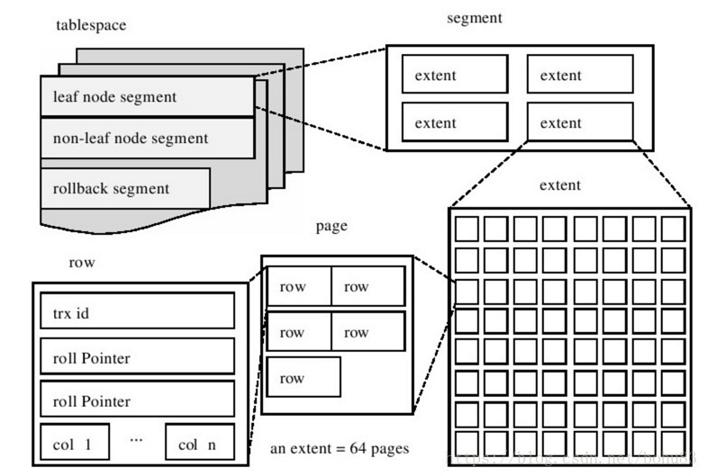
### 区
- 区是由连续页组成的空间,在任何情况下每个区的大小都为1MB。为了保证区中页的连续性，InnoDB存储引擎一次从磁盘申请4~5个区. 在默认情况下, Innodb存储引擎页的大小为16KB, 一个区中一共由64个连续的页
- 每个段开始时，先用32个页大小的碎片页去存放数据，在使用完这些页之后才开始申请64个连续的页
这样做的目的是：对于一些小表，或者是undo这类的段，可以在开始时申请较少的空间，节省磁盘容量的开销

### 页
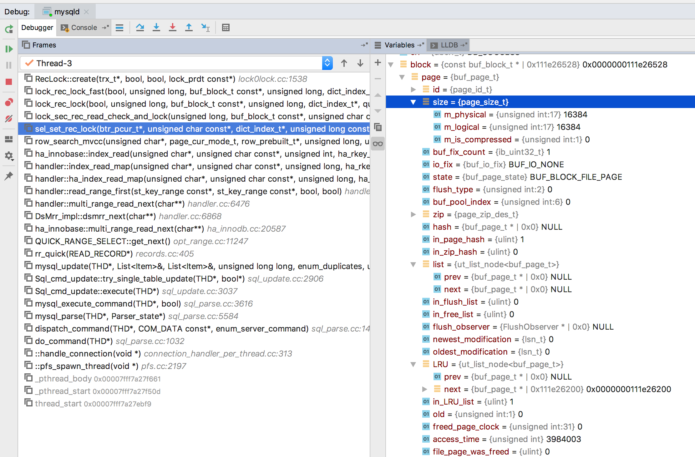
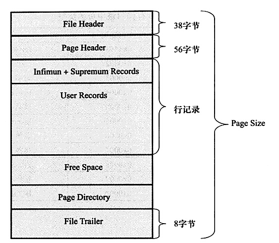

File Header 字段用于记录 Page 的头信息，其中比较重要的是 FIL_PAGE_PREV 和 FIL_PAGE_NEXT 字段，通过这两个字段，我们可以找到该页的上一页和下一页，实际上所有页通过两个字段可以形成一条双向链表。Page Header 字段用于记录 Page 的状态信息。接下来的 Infimum 和 Supremum 是两个伪行记录，Infimum（下确界）记录比该页中任何主键值都要小的值，Supremum （上确界）记录比该页中任何主键值都要大的值，这个伪记录分别构成了页中记录的边界。

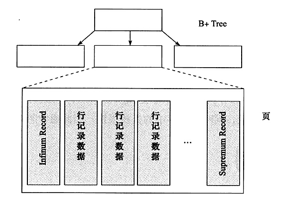

## B+树
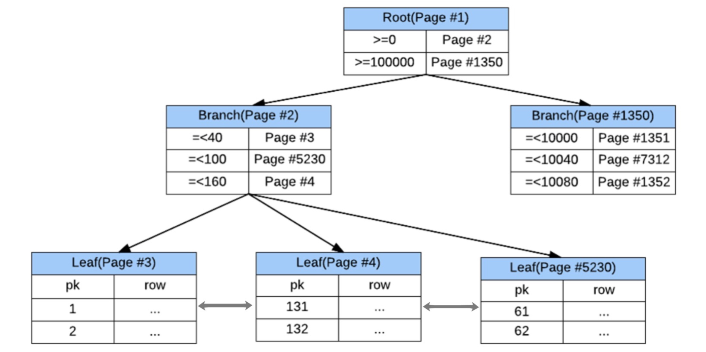

## 问题四 为什么使用B+树而不用hash或者B树或者红黑树?
范围检索,顺序查找,降低深度,减少IO

## 问题五 mysql使用B+树为了减少磁盘IO次数,对于辅助索引/非聚簇索引,mysql是如何减少磁盘io的?

### 插入缓冲
Innodb数据表本身就是一个聚集索引表，表中的记录按照聚集索引顺序存储，插入时按聚集索引自增插入，顺序写磁盘，速度是有保证的；但对于非聚集索引，插入操作就不那么顺利了，非聚集索引并非按顺序插入，因此在插入非聚集索引叶节点时，为随机插入，性能不高；
对于非聚集索引的插入或更新操作，不是每一次操作都直接插入索引页中，而是先判断插入的非聚集索引页是否在缓冲池中，如果在则直接插入；如果不在，则先放入一个插入缓冲区中，返回插入成功的结果。然后由master thread以一定的频率执行插入缓冲和非聚集索引叶子节点的合并操作，这时通常能将多个插入合并到一个IO操作中（因为多个插入在同一个索引叶节点中），提高了对非聚集索引的插入和更新性能，MySQL官方手册给出的优化结果，采用插入缓冲性能提升15倍

### MRR
MRR 是 Multi-Range Read 的简写，目的是减少磁盘随机访问，将随机访问转化为较为顺序的访问。适用于辅助索引explain 中type为 range/ref/eq_ref 类型的查询。
在二级索引查找后，根据得到的主键到聚簇索引找出需要的数据。二级索引查找得到的主键的顺序是不确定的，因为二级索引的顺序与聚簇索引的顺序不一定一致；
如果没有 MRR，那么在聚簇索引查找时就可能出现乱序读取数据页，这对于机械硬盘是及其不友好的。MRR 的优化方式：将查找到的二级索引键值放在一个缓存中；将缓存中的键值按照 主键 进行排序；根据排序后的主键去聚簇索引访问实际的数据文件。
如果查询使用的二级索引的顺序本身与结果集的顺序一致，那么使用 MRR 后需要对得到的结果集进行排序。使用 MRR 还可以减少缓冲池中页被替换的次数，批量处理对键值的查询操作。

### ICP
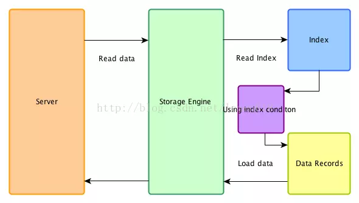
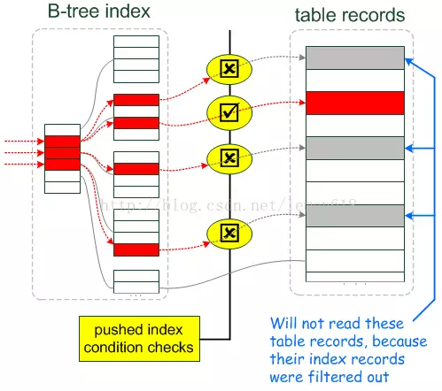

Index Condition Pushdown(ICP),ICP可以减少存储引擎访问基表的次数以及MySQL服务器访问存储引擎的次数。适用于辅助索引explain 中type为range、 ref、 eq_ref或者ref_or_null类型的查询,
storage层：
首先将index key条件满足的索引记录区间确定，然后在索引上使用index filter进行过滤
将满足的index filter条件的索引记录才去回表取出整行记录返回server层
不满足index filter条件的索引记录丢弃，不回表、也不会返回server层
server 层：
对返回的数据，使用table filter条件做最后的过滤。

## rw lock
```
enum rw_lock_type_t {
	RW_S_LATCH = 1,
	RW_X_LATCH = 2,
	RW_SX_LATCH = 4,
	RW_NO_LATCH = 8
};
```
|rw| S|SX| X|
|-|-|-|-|
|S | o| o| x|
|SX| o| x| x|
|X | x| x| x|
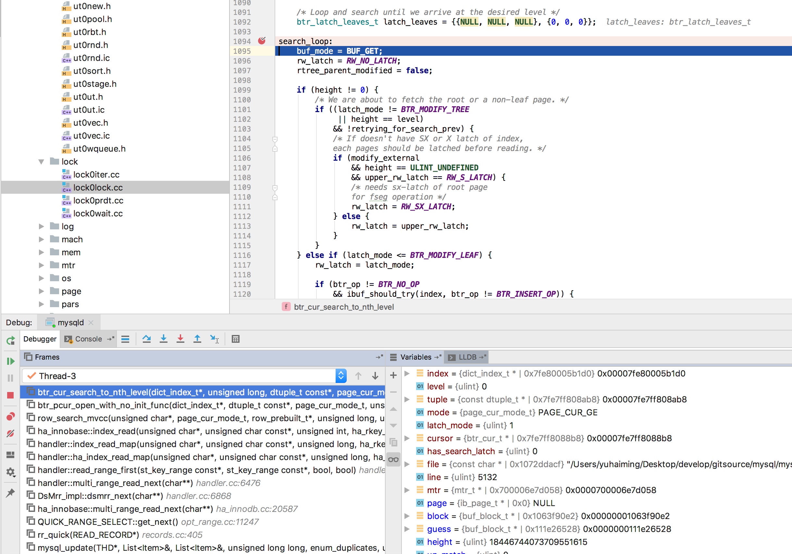
首先是hold住index lock的RW_S_LATCH，然后通过btr_cur_search_to_nth_level进行B-Tree查询leaf节点的过程。当cursor定位到leaf节点上之后，在leaf page节点上，添加RW_S_LATCH锁，即S锁，然后通过save_point的mtr释放index lock的S锁。在扫描的过程中，因为持有index的RW_S_LATCH，所以节点的扫描比如root、branch这样的node block，并不持有任何node的rw lock。直到latch住leaf节点后，就释放掉 index 的锁，这样尽可能的减少阻塞，剩下就是leaf节点的扫描过程，只持有leaf page的锁。 扫描完数据，就释放leaf page的S锁。
1. BTR_SEARCH_LEAF

对于扫描leaf节点和修改leaf节点的场景：

index->lock 持有S锁不变<br>
branch->latch 从无--> S latch<br>
   latch order:<br>
       latch root block (S)<br>
       latch root-1 block (S)<br>
       ....<br>
       latch leaf+1 block (S)<br>
leaf->latch 持有S或者X锁不变<br>
release index lock 不变<br>
release branch latch 从无到释放<br>
和之前的差别是在search的过程中，对使用到的branch节点，加上S锁，用于同步branch节点的修改。同样，当定位到leaf节点后，就可以把index lock和branch lock全部释放掉了，后面leaf节点之间的移动，同样不需要index lock和branch lock。

2. BTR_MODIFY_TREE

对于修改index B-Tree结构的场景：

index->lock 从X锁-->SX 锁<br>
branch->latch 从无--> X latch<br>
注意：因为有index SX锁，所以不允许并发的修改B-Tree操作，所以，只需要X latch要修改的branch即可。

和之前的差别就是index lock从X锁变成了SX锁，这样并不影响search的过程，增加了更改过程中branch节点的X锁。

总结：
这样修改后，index lock在并发的过程中，修改B-Tree和search B-Tree没有了并发冲突问题，在split的过程中，只有search和modify到同一个branch节点，才会产生阻塞，对于我们正常的使用数据库过程中（大部分都是通过index进行读写），可以显著的提升并发能力。
## RecLock
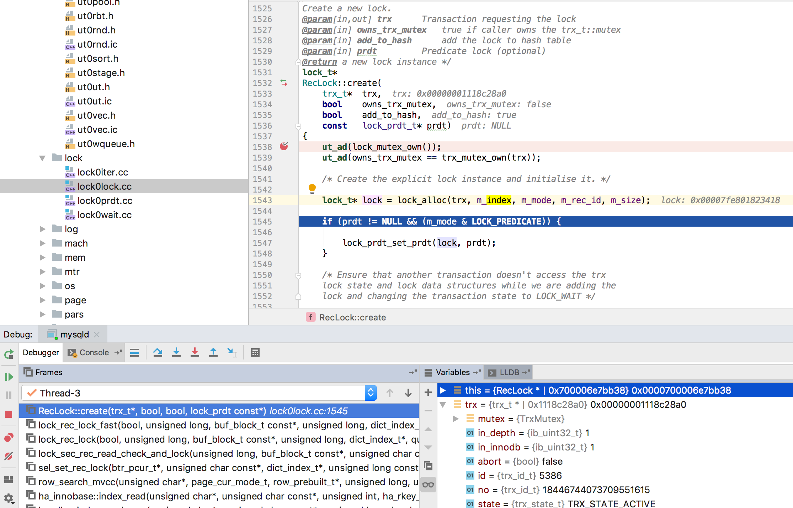
## 索引和锁
```
CREATE TABLE `author` (
  `id` int(11) NOT NULL AUTO_INCREMENT,
  `name` varchar(255) DEFAULT NULL,
  `age` int(11) DEFAULT NULL,
  PRIMARY KEY (`id`),
  KEY `idx_name` (`name`)
) ENGINE=InnoDB AUTO_INCREMENT=26 DEFAULT CHARSET=utf8
INSERT into author VALUES (1,'g1',20),(5,'g5',20),(15,'g15',30),(20,'g20',30);
```
| id | name | age  |
|-|-|-|
|  1 | g1   |   20 |
|  5 | g5   |   20 |
| 16 | g16  |   21 |
| 20 | g20  |   30 |

update author set age=18 where name='g16';

insert into author(id,name,age)values(15,'g15',15)
------- TRX HAS BEEN WAITING 4 SEC FOR THIS LOCK TO BE GRANTED:
RECORD LOCKS space id 32 page no 4 n bits 72 index idx_name of table `test`.`author` trx id 5399 lock_mode X locks gap before rec insert intention waiting
Record lock, heap no 6 PHYSICAL RECORD: n_fields 2; compact format; info bits 0
 0: len 3; hex 673136; asc g16;;
 1: len 4; hex 80000010; asc     ;;

insert into author(id,name,age)values(17,'g17',17)
------- TRX HAS BEEN WAITING 5 SEC FOR THIS LOCK TO BE GRANTED:
RECORD LOCKS space id 32 page no 4 n bits 72 index idx_name of table `test`.`author` trx id 5399 lock_mode X locks gap before rec insert intention waiting
Record lock, heap no 5 PHYSICAL RECORD: n_fields 2; compact format; info bits 0
 0: len 3; hex 673230; asc g20;;
 1: len 4; hex 80000014; asc     ;;

 update author set age=21 where name='g16'
Trx read view will not see trx with id >= 5400, sees < 5396
------- TRX HAS BEEN WAITING 5 SEC FOR THIS LOCK TO BE GRANTED:
RECORD LOCKS space id 32 page no 4 n bits 72 index idx_name of table `test`.`author` trx id 5399 lock_mode X waiting
Record lock, heap no 6 PHYSICAL RECORD: n_fields 2; compact format; info bits 0
 0: len 3; hex 673136; asc g16;;
 1: len 4; hex 80000010; asc     ;

## 原子性、一致性、持久性

InnoDB是事务的存储引擎,其通过Force Log at Commit机制实现事务的持久性,日志操作由MTR(mini-transaction)底层模块实现. 即当事务提交(COMMIT)时,必须先将该事务的所有日志写入到重做日志文件进行持久化,待事务的 COMMIT操作完成才算完成。 这里的日志是指重做日志,在InnoDB存储引擎中,由两部分组成,即redo log和undo log。redo log用来保证事务的持久性,undo log用来帮助事务回滚及MvCC的功能。redo log基本上都是顺序写的,在数据库运行时不需要对redo log的文件进行读取操作。而undo log是需要进行随机读写的。
### redo log
重做日志用来实现事务的持久性,即事务ACID中的D。其由两部分组成:一是内存中的重做日志缓冲(redolog buffer),其是易失的:二是重做日志文件( redo log file),其是持久的。主要作用是用于数据库的崩溃恢复.
#### 什么时候写redo
在数据页修改完成之后，在脏页刷出磁盘之前，写入redo日志。注意的是先修改数据，后写日志
redo日志比数据页先写回磁盘
聚集索引、二级索引、undo页面的修改，均需要记录Redo日志。
#### Redo的整体流程
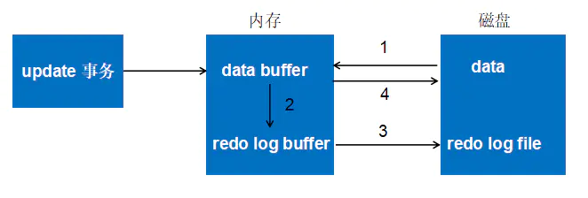
- 第一步：先将原始数据从磁盘中读入内存中来，修改数据的内存拷贝
- 第二步：生成一条重做日志并写入redo log buffer，记录的是数据被修改后的值
- 第三步：当事务commit时，将redo log buffer中的内容刷新到 redo log file，对 redo log file采用追加写的方式
- 第四步：定期将内存中修改的数据刷新到磁盘中
## 如何保证事务的持久性?
InnoDB是事务的存储引擎，其通过Force Log at Commit 机制实现事务的持久性，即当事务提交时，先将 redo log buffer 写入到 redo log file 进行持久化，待事务的commit操作完成时才算完成。这种做法也被称为 Write-Ahead Log(预先日志持久化)，在持久化一个数据页之前，先将内存中相应的日志页持久化。
为了保证每次日志都写入redo log file，在每次将redo buffer写入redo log file之后，默认情况下，InnoDB存储引擎都需要调用一次 fsync操作,因为重做日志打开并没有 O_DIRECT选项，所以重做日志先写入到文件系统缓存。为了确保重做日志写入到磁盘，必须进行一次 fsync操作。fsync是一种系统调用操作，其fsync的效率取决于磁盘的性能，因此磁盘的性能也影响了事务提交的性能，也就是数据库的性能。


MySQL的事务日志中，为了性能和效率，可以配置每次事务提交后是否将日志缓冲刷到log file以进行数据持久化，这就是变量innodb_flush_log_at_trx_commit的作用。innodb_flush_log_at_trx_commit有3种值：0、1、2，默认为1。但注意，这个变量只是控制commit动作是否刷新log buffer到磁盘，而没有其它的数值意义。
当设置为1的时候：事务每次提交都会将log buffer中的日志写入os buffer并调用fsync()刷到log file on disk中。这种方式即使系统崩溃也不会丢失任何数据，但是因为每次提交都写入磁盘，IO的性能较差。
当设置为0的时候：事务提交时不会将log buffer中日志写入到os buffer，而是每秒写入os buffer并调用fsync()写入到log file on disk中。也就是说设置为0时是(大约)每秒刷新写入到磁盘中的，当系统崩溃，最多会丢失1秒钟的数据。
当设置为2的时候：每次提交都仅写入到os buffer，然后是每秒调用fsync()将os buffer中的日志写入到log file on disk。保证安全性获得性能80%提升

## 问题六 Redo在InnoDB中是如何实现的？与mini-transaction的联系？
Redo的实现实则跟mini-transaction紧密相关，mini-transaction是一种InnoDB内部使用的机制，通过mini-transaction来保证并发事务操作下以及数据库异常时数据页中数据的一致性，但它不属于事务。

为了使得mini-transaction保证数据页数据的一致性，mini-transaction必须遵循以下三种协议：

- The FIX Rules

修改一个数据页时需要获得该页的x-latch(排他锁)，获取一个数据页时需要该页的s-latch(读锁或者称为共享锁) 或者是 x-latch，持有该页的锁直到修改或访问该页的操作完成。

- Write-Ahead Log

在前面阐述中就提到了Write-Ahead Log(预先写日志)。在持久化一个数据页之前，必须先将内存中相应的日志页持久化。每个页都有一个LSN(log sequence number)，代表日志序列号，（LSN占用8字节，单调递增), 当一个数据页需要写入到持久化设备之前，要求内存中小于该页LSN的日志先写入持久化设备

那为什么必须要先写日志呢？可不可以不写日志，直接将数据写入磁盘？原则上是可以的，只不过会产生一些问题，数据修改会产生随机IO，但日志是顺序IO，append方式顺序写，是一种串行的方式，这样才能充分利用磁盘的性能。

- Force-log-at-commit

这一点也就是前文提到的如何保证事务的持久性的内容，这里再次总结一下，与上面的内容相呼应。在一个事务中可以修改多个页，Write-Ahead Log 可以保证单个数据页的一致性，但是无法保证事务的持久性，Force-log-at-commit 要求当一个事务提交时，其产生所有的mini-transaction 日志必须刷新到磁盘中，若日志刷新完成后，在缓冲池中的页刷新到持久化存储设备前数据库发生了宕机，那么数据库重启时，可以通过日志来保证数据的完整性。

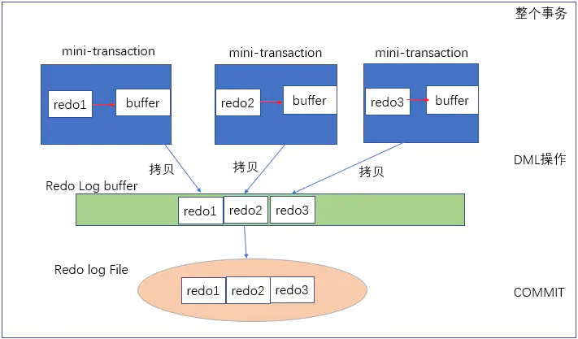

上图表示了重做日志的写入流程，每个mini-transaction对应每一条DML操作，比如一条update语句，其由一个mini-transaction来保证，对数据修改后，产生redo1，首先将其写入mini-transaction私有的Buffer中，update语句结束后，将redo1从私有Buffer拷贝到公有的Log Buffer中。当整个外部事务提交时，将redo log buffer再刷入到redo log file中。

## 问题七 什么时候触发redolog buffer写入redolog file?
- 事务提交时
- 当log buffer中有一定的内存空间已经被使用时
- log checkpoint时

## checkpoint
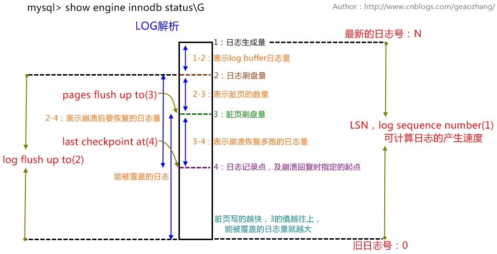
### checkpoint的目的
1. 缩短数据库的恢复时间
2. buffer pool空间不够用时，将脏页刷新到磁盘
3. redolog不可用时，刷新脏页

### 检查点分类
#### sharp checkpoint：完全检查点，数据库正常关闭时，会触发把所有的脏页都写入到磁盘上(这时候logfile的日志就没用了，脏页已经写到磁盘上了)。
1. 完全检查点，发生在数据库正常关闭的时候。
2. 在数据库在运行时不会使用sharp checkpoint，在引擎内部使用fuzzy checkpoint，即只刷新一部分脏页，而不是刷新所有的脏页回磁盘。

#### fuzzy checkpoint：模糊检查点，部分页写入磁盘。
1. 发生在数据库正常运行期间。
2. 模糊检查点，不是sharp的就是模糊检查点(4种)：master thread
checkpoint、flush_lru_list checkpoint、async/sync flush checkpoint、dirty page
too much checkpoint。
#### master thread checkpoint
　　差不多以每秒或每十秒的速度从缓冲池的脏页列表中刷新一定比例的页回磁盘，这个过程是异步的，不会阻塞用户查询。
1. 周期性，读取flush list，找到脏页，写入磁盘
2. 写入的量比较小
3. 异步，不影响业务
#### flush_lru_list checkpoint
　　读取lru list，找到脏页，写入磁盘。 扫描innodb_lru_scan_depth个(默认1024个)lru冷端数据页，将脏页写入磁盘(有10个就刷10，有100个就刷100个……)
#### async/sync flush checkpoint
　　log file快满了，会批量的触发数据页回写，这个事件触发的时候又分为异步和同步，不可被覆盖的redolog占log file的比值：75%--->异步、90%--->同步。
　　当这两个事件中的任何一个发生的时候，都会记录到errlog中，一旦errlog出现这种日志提示，一定需要加大logfile。
　　Async/Sync Flush Checkpoint是为了保证重做日志的循环使用的可用性。在InnoDB 1.2.x版本之前，Async Flush Checkpoint会阻塞发现问题的用户查询线程，而Sync Flush Checkpoint会阻塞所有的用户查询线程，并且等待脏页刷新完成。从InnoDB 1.2.x版本开始——也就是MySQL 5.6版本，这部分的刷新操作同样放入到了单独的Page Cleaner Thread中，故不会阻塞用户查询线程,所有需要写脏数据库的用户线程都会堵塞.
#### dirty page too much checkpoint
　　很明显，脏页太多检查点，为了保证buffer pool的空间可用性的一个检查点。

### undo log
undo是一种逻辑日志，有两个作用：
1. 用于事务的回滚
当InnoDB存储引擎回滚时，它实际上做的是与先前相反的工作。
对于每个INSERT，InnoDB存储引擎会完成一个DELETE；
对于每个DELETE，InnoDB存储引擎会执行一个INSERT；
对于每个UPDATE，InnoDB存储引擎会执行一个相反的UPDATE，将修改前的行放回去。
2. mvcc
InnoDB存储引擎中MVCC的实现是通过undo来完成的, 当用户读取一行记录是,
若该记录已经被其他事务占用, 当前事务可以通过undo读取之前的行版本信息,
以此实现非锁定读取.
#### undo log的写入时机
DML操作修改聚簇索引前，记录undo日志
二级索引记录的修改，不记录undo日志
需要注意的是，undo页面的修改，同样需要记录redo日志。
#### 存储位置
在InnoDB存储引擎中，undo存储在回滚段(Rollback Segment)中,每个回滚段记录了1024个undo log segment，而在每个undo log segment段中进行undo 页的申请，在5.6以前，Rollback Segment是在共享表空间里的

## 问题八 undo log 为了MVCC,每次update都要插入一行新的undo page的记录,磁盘不会被撑爆吗?mysql是怎么做的

#### undo的类型
在InnoDB存储引擎中，undo log分为：

insert undo log
update undo log
insert undo log是指在insert 操作中产生的undo log，因为insert操作的记录，只对事务本身可见，对其他事务不可见。故该undo log可以在事务提交后直接删除，不需要进行purge操作。

而update undo log记录的是对delete 和update操作产生的undo log，该undo log可能需要提供MVCC机制，因此不能再事务提交时就进行删除。提交时放入undo log链表history list，等待purge线程进行最后的删除。

补充：purge线程两个主要作用是：清理undo页和清除page里面带有Delete_Bit标识的数据行。在InnoDB中，事务中的Delete操作实际上并不是真正的删除掉数据行，而是一种Delete Mark操作，在记录上标识Delete_Bit，而不删除记录。是一种"假删除",只是做了个标记，真正的删除工作需要后台purge线程去完成。

### binlog
binlog是记录所有数据库表结构变更（例如CREATE、ALTER TABLE…）以及表数据修改（INSERT、UPDATE、DELETE…）的二进制日志。
binlog不会记录SELECT和SHOW这类操作，因为这类操作对数据本身并没有修改，但你可以通过查询通用日志来查看MySQL执行过的所有语句。

这个二进制日志包括两类文件：

- 索引文件（文件名后缀为.index）用于记录哪些日志文件正在被使用

- 日志文件（文件名后缀为.00000\*）记录数据库所有的DDL和DML(除了数据查询语句)语句事件。

(2)sync_binlog=0:表示刷新binlog时间点由操作系统自身来决定，操作系统自身会每隔一段时间就会刷新缓存数据到磁盘，这个性能最好。sync_binlog=1，代表每次事务提交时就会刷新binlog到磁盘。sync_binlog=N,代表每N个事务提交会进行一次binlog刷新。

另外，这里存在一个一致性问题，sync_binlog=N，数据库在操作系统宕机的时候，可能数据并没有同步到磁盘，于是再次重启数据库，会带来数据丢失问题。 
当sync_binlog=1，事务在Commit的时候，数据写入binlog，但是还没写入事务日志(redo
log和undo
log)。此时宕机，重启数据库，数据被回滚。但是binlog里已经记录，这里存在不一致问题。这个事务日志和binlog一致性的问题
第一阶段：InnoDB prepare，持有prepare_commit_mutex，并且write/sync redo log； 将回滚段设置为Prepared状态，binlog不作任何操作；

第二阶段：包含两步，1> write/sync Binlog； 2> InnoDB commit (写入COMMIT标记后释放prepare_commit_mutex)；

以 binlog 的写入与否作为事务提交成功与否的标志，innodb commit标志并不是事务成功与否的标志。因为此时的事务崩溃恢复过程如下：

1> 崩溃恢复时，扫描最后一个Binlog文件，提取其中的xid；
2> InnoDB维持了状态为Prepare的事务链表，将这些事务的xid和Binlog中记录的xid做比较，如果在Binlog中存在，则提交，否则回滚事务。

通过这种方式，可以让InnoDB和Binlog中的事务状态保持一致。如果在写入innodb commit标志时崩溃，则恢复时，会重新对commit标志进行写入；

在prepare阶段崩溃，则会回滚，在write/sync binlog阶段崩溃，也会回滚。这种事务提交的实现是MySQL5.6之前的实现。


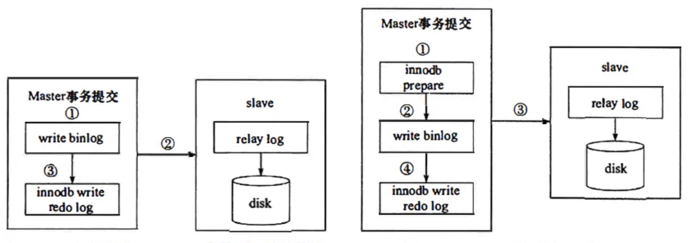

## 问题九 如何快速导入mysql 1000万条数据


---


[^1]: MySQL技术内幕:InnoDB存储引擎(第2版) https://book.douban.com/subject/24708143/ 
[^2]: 浅析MySQL事务中的redo与undo https://www.jianshu.com/p/20e10ed721d0
